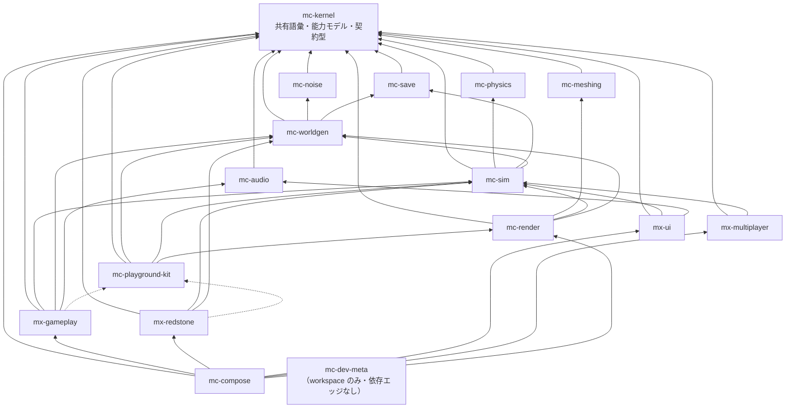

# アーキテクチャ

出典: plan.md §2。本書は plan.md の構成を kernel 視点で読み直したもの。
全 16 リポジトリの graph は組織アーキテクチャの記録としてここに保持し、
このリポジトリ自身の import 境界は `.oxlintrc.json` と `package.json` で検査する。

## 1. 4 階層

単一リポジトリ（参照実装 84k LOC）では「正しく動くことが保証される単位」が大きすぎた。
そこで**ゲーム UX を構成する体験単位ごとにリポジトリを分け、各リポジトリが単独で「テスト green + プレビューで目視確認済み」を閉じる**構成を採る。

| 階層 | リポジトリ | 性質 |
| --- | --- | --- |
| 安定ライブラリ | `mc-kernel` / `mc-noise` / `mc-meshing` / `mc-physics` / `mc-save` / `mc-audio` | 純粋関数・狭い界面・変更頻度が低い。相互独立で並行構築可能 |
| 基盤 | `mc-worldgen` / `mc-sim` / `mc-render` / `mc-playground-kit` | 状態とサービス（**名詞**）。体験モジュールが乗る土台 |
| 体験モジュール | `mx-gameplay` / `mx-redstone` / `mx-ui` / `mx-multiplayer` | ルールと UI（**動詞**）。互いを知らず、基盤サービス経由でのみ会話する |
| 合成 | `mc-compose` | Layer マージ + stage 順序表 + E2E。ロジックを持たない |

これに開発用の `mc-dev-meta`（15 リポジトリを `repos/` に clone して 1 つの pnpm workspace として束ねる薄いリポジトリ、plan.md §6 Step 0）を加えて 16。

## 2. 依存グラフ（全 16 リポジトリ）

実線 = 実行時依存（`dependencies`）、点線 = プレビュー起動時のみ（`devDependencies`）。



この表は組織全体の依存 graph の記録であり、「16 行あること」「非循環であること」「全エッジの行先が存在すること」
を判断する際の基準である。各リポジトリに graph 検査スクリプトを複製する方式は廃止し、
このリポジトリでは直接依存の import 境界を `pnpm lint` で検査する。

### `dependencyGraph` に書かないもの（2 種類）

| 書かないもの | 理由 |
| --- | --- |
| `@nerima-games/mc-kernel` を依存先として | kernel はどこからでも import 可（後述）。組織 graph の記録には通常の edge として書かない |
| `mx-gameplay -> mc-playground-kit` などの kit エッジ | kit は devDependency 専用であり**実行時エッジではない**。実行時グラフに載せると `kit -> render -> sim` と `gameplay -> sim` により循環に見えてしまう |

## 3. mc-kernel の位置づけ — 唯一の例外

**mc-kernel は全リポジトリが import してよい。そして、そういうリポジトリは kernel だけである。**

- kernel は共有語彙そのものなので、組織 graph 上の通常の import 許可リストには載せない。
  ただし `package.json` の `dependencies` への記載は必要 — 「どこからでも import 可」はポリシー上の免除であって、
  パッケージング上の免除ではない。
- 逆に **kernel は他のどのリポジトリにも依存できない**。全リポジトリが kernel に依存する以上、
  kernel が誰かに依存した時点で構造的に循環が生じる。`REPOSITORY_POLICY` の kernel 行が空集合であることがこれを保証する。

### 推移閉包は認めない（kernel 以外に例外なし）

依存は**その依存先を import してよいという許可であって、その先を import してよいという許可ではない**。

```
mc-render -> mc-sim -> mc-physics
```

のとき、`mc-render` は `mc-physics` を import **できない**。
`mc-physics` が欲しければ直接依存として宣言する（`dependencyGraph` と `package.json` の両方に）。
依存先の依存先に手を伸ばすのは、16 リポジトリ分割が静かにモノリスへ戻る経路そのものである。

このルールは組織 graph を更新・レビューするときの基準である。kernel 自身は他の
`@nerima-games/*` パッケージを依存しないため、ローカルでは `.oxlintrc.json` の
`no-restricted-imports` と `package.json` の依存宣言を検査すれば、kernel の層を保てる。

## 4. 設計ルール

### 4-1. 基盤 = 名詞、体験 = 動詞（plan.md §2.3-1）

- `InventoryService` のような**状態の置き場**は基盤（`mc-sim`）に置く。
- 「掘ったらドロップしてインベントリに入る」という**ルール**は体験（`mx-gameplay`）に置く。
- **体験モジュール間の依存エッジはゼロ。** 「採掘 → インベントリに入る」は `mx-gameplay` が `mc-sim` の `InventoryService` を呼ぶことで実現し、
  `mx-gameplay` が `mx-ui` を知ることはない。

グラフ上でこれは「Tier 3 の 4 リポジトリの間にエッジが 1 本もない」として現れ、テストで固定してある。

kernel にとっての含意: kernel は名詞でも動詞でもなく**語彙**である。
`InventoryService` は kernel に置かない（サービス実装は基盤の仕事）。`Position` や `BlockCapabilities` は kernel に置く。

### 4-2. mc-playground-kit は devDependency 専用（plan.md §2.3-2）

kit は「ミニ平地ワールド + カメラ + レンダラ + 入力を 1 秒で束ねる糊」であり、プレビュー起動専用の開発ツールである。

**実行時入力サービスは `mc-render` が所有する。** kit に入力を置くと、kit は出荷されないので**本番ゲームから入力処理が消える**。
これが「kit を `dependencies` に入れてはならない」ルールの実質的な理由であり、違反時のエラーメッセージにもそう書いてある。

強制は 2 段構え:

1. `DEV_ONLY_PACKAGES` に載っているパッケージが `dependencies` にあれば `dev-only-package-in-dependencies` で fail。
2. 出荷ソース（`index.ts` と `domain/`）から import されていれば `dev-only-package-in-shipped-source` で fail。テスト・スクリプトからは可。

### 4-3. stage 全順序は mc-compose だけが所有する（plan.md §2.3-3）

各モジュールは `StageRegistration` で**順序制約（`after`）を宣言するだけ**であり、全順序は `mc-compose` が解決する。

```
input
  → simulation (physics → interactions → entities → fluids → redstone → time/weather)
  → camera-mirror
  → chunk-sync
  → render
  → post-fx
  → hud-sync
```

この骨格（plan.md §4.2）は `mc-compose` の資産であって kernel の資産ではない。
kernel が持つのは `StageId` / `StageRegistration` / `GameModule` という**契約の型だけ**である。
kernel に標準順序表を置くと、順序を変えるたびに kernel を bump することになり、全リポジトリが巻き込まれる。

`after` は「その stage が存在すること」への依存ではない。存在しない stage を名指しした場合はエッジが無いものとして扱う。
これにより「input があるなら input の後で走らせてほしい」を、input リポジトリへの依存なしに表現できる。
落ちたエッジは**拒否せず報告する**: `mc-compose` の `StageOrderPlan` が `dangling` と、
骨格のどの phase にも属さなかった stage を表す `unmatchedPhase` の両方を運ぶ。

`GameModule.frameStages` は配列ではなく `Effect` である。モジュールが stage を**組み立てる**ために
サービスを取得できる瞬間がそこにしか無く、それが無いと「どれか 1 つの stage が触るサービス」が
全部 `FrameServices` に入ってしまい、kernel が `mc-sim` / `mc-render` を名指しせざるを得なくなる。
経緯は [freeze-checklist.md](./freeze-checklist.md) (b)。

## 5. リポジトリ / パッケージ / プレビューを混同しない（plan.md §2.4）

| 単位 | 役割 | 粒度 |
| --- | --- | --- |
| リポジトリ | 検証・リリースの単位（CI / バージョン / 公開） | 16 個で固定 |
| パッケージ | 依存境界の単位（リポジトリ内 workspace で維持） | 自由に細かく |
| プレビュー | 起動の単位 | 1 リポジトリに複数可 |

mc-kernel は現在パッケージ分割しておらず、`domain/` 単一である。分割するとしてもリポジトリは増やさない
（plan.md §5.3: core と block の分離は「ブロック追加が必ず両方を共変更する」ため棄却済み）。

## 6. 2026年の内部モジュール境界

リポジトリの公開パッケージ境界は一つのまま、実装ファイルは変更理由が異なる責務ごとに分ける。

| 領域 | data | logic |
| --- | --- | --- |
| 語彙 | `domain/block-type-data.ts` / `item-type-data.ts` | `domain/block-type.ts` / `item-type.ts` の型・runtime guard |
| 座標 | `domain/coordinate-primitives.ts` の定数・ブランド | key、近傍、変換、幾何を各モジュールに分離 |
| Anvil | `domain/anvil-constants.ts` | validation、transformation、`anvil-planning.ts` の orchestration |
| ブロックレジストリ | `domain/block-registry-entries*.ts`（地形・鉱石・構造物などのフラグメント）、`block-registry-rules.ts` | 派生インデックスと検索は `block-registry-indexes.ts`、安定した公開パスは `block-registry.ts` |

`src/index.ts` はこの実装分割を隠し、消費側には意図した公開 API だけを提供する。内部モジュールを
直接 import させるための Adapter や互換 shim は新設しない。公開 API を変える場合は、型検査・公開 API
テスト・生成 tarball の clean consumer 検証を同じ変更で更新する。

開発環境は `flake.nix` / `flake.lock` と `package.json` の `engines` / `packageManager` を正本とする。
ASDF/asd、devenv、別の package-manager 用設定は置かない。Node.js 24 と pnpm 11 を前提に、Nix を使わない
場合も同じバージョン境界を守る。
